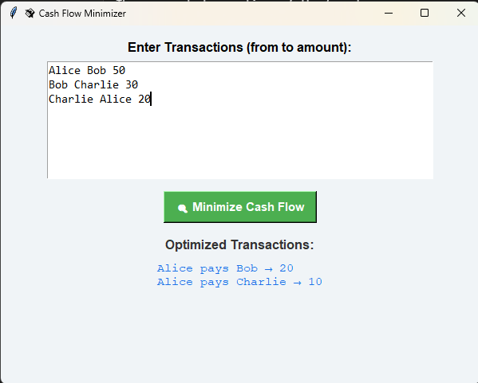

# 💸 Cash Flow Minimizer (Python + Tkinter GUI)

A simple Python GUI app that helps minimize cash flow in group transactions using **graph and heap** DSA concepts.

## 🚀 Features

- Clean Tkinter GUI
- Greedy algorithm to minimize transactions
- Graph + heap logic implementation
- Real-time input and output
- Beginner-friendly and educational

## 🧠 How It Works

The app reads transactions of the format:

Alice Bob 50

Bob Charlie 30

Charlie Alice 20


Then it calculates **who should pay whom and how much** to minimize cash flow within the group.

## 📷 Screenshot



## 🛠️ Tech Stack

- Python 3
- Tkinter (for GUI)
- heapq, collections (for DSA logic)

## 💡 Run the App

1. Make sure Python 3 is installed
2. Clone the repo:
   ```bash
   git clone https://github.com/your-username/cash-flow-minimizer.git
   cd cash_flow_minimizer
3. Run:
   ````bash
    python main.py

---